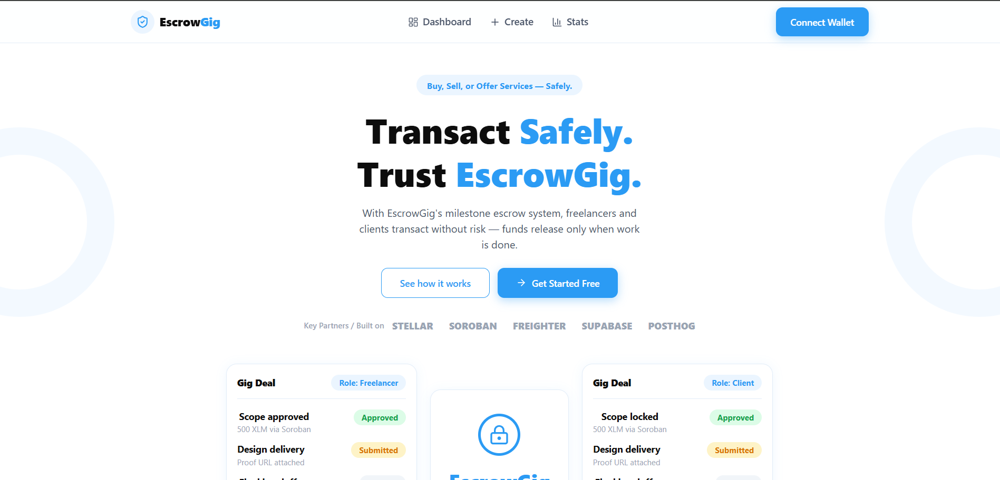
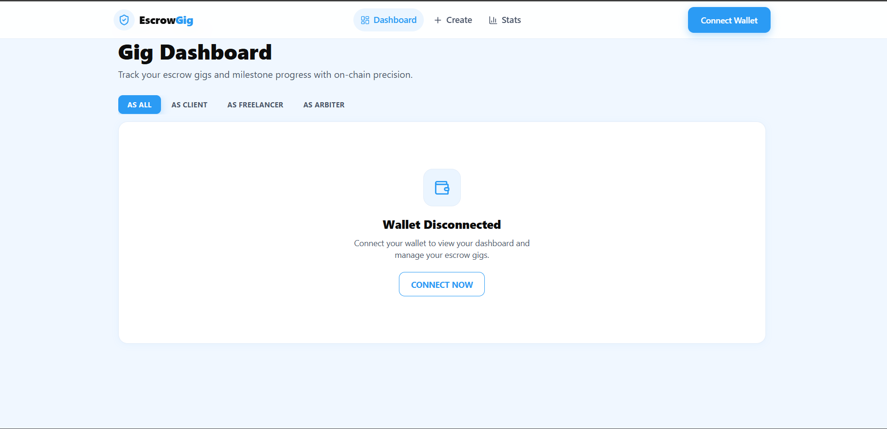
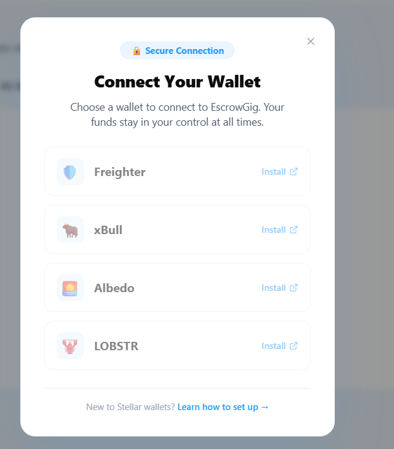
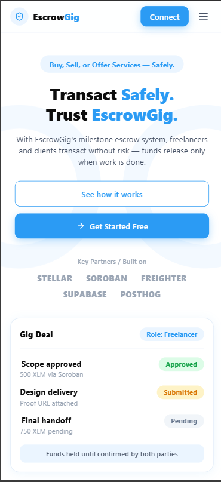
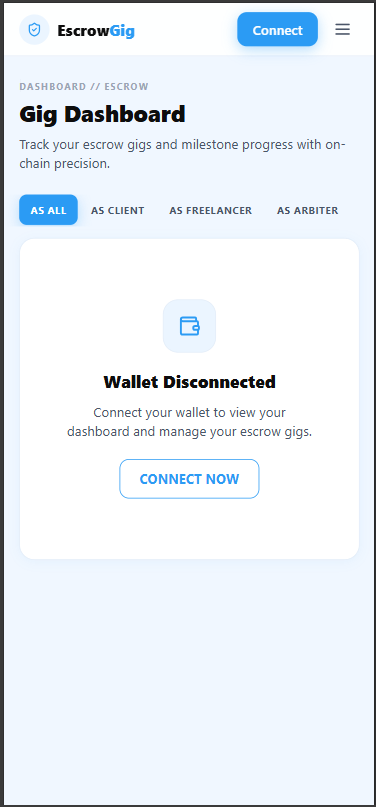
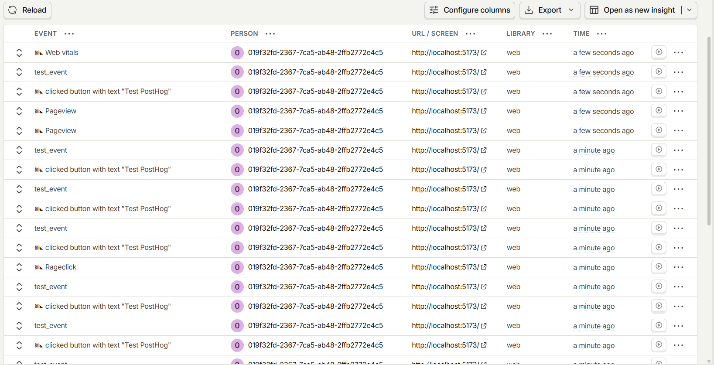

# EscrowGig

EscrowGig is a milestone-based decentralised freelance escrow dApp built on Stellar. Clients fund an escrow contract up front, freelancers submit proof for each milestone, and a preassigned arbiter can resolve disputes if the parties disagree.

The repository includes a Soroban Rust smart contract and a React + TypeScript frontend using Vite, TailwindCSS, Stellar Wallets Kit, and `@stellar/stellar-sdk`.

---

## Live Deployment

| | |
|---|---|
| **Frontend** | https://es-crow-gig-opjw.vercel.app/ |
| **Stellar Testnet Contract ID** | `CB64ATOQFOZUFGUXWSFK5NS7WIAAPFUZLVJQGGQHQ47LDSF2KUWYIUCC` |
| **Network** | Stellar Testnet |

> The contract is live on Stellar Testnet. You can inspect it on [Stellar Expert](https://stellar.expert/explorer/testnet/contract/CB64ATOQFOZUFGUXWSFK5NS7WIAAPFUZLVJQGGQHQ47LDSF2KUWYIUCC).

---

## Screenshots

### 🖥️ Desktop — Landing Page

<div align="center">
  <table>
    <tr>
      <td align="center">
        <!-- browser chrome -->
        <table cellpadding="0" cellspacing="0" style="border-radius:10px;overflow:hidden;border:1px solid #d0d7de;background:#f6f8fa;width:780px;">
          <tr>
            <td style="padding:8px 12px;background:#f6f8fa;border-bottom:1px solid #d0d7de;">
              &nbsp;⬤&nbsp;&nbsp;⬤&nbsp;&nbsp;⬤&nbsp;&nbsp;&nbsp;&nbsp;
              <code style="font-size:11px;color:#57606a;background:#ffffff;padding:2px 60px;border-radius:4px;border:1px solid #d0d7de;">localhost:5173</code>
            </td>
          </tr>
          <tr>
            <td style="padding:0;">
              
            </td>
          </tr>
        </table>
        <br/><sub><b>Landing Page</b></sub>
      </td>
    </tr>
  </table>
</div>

### 🖥️ 10+ User Interaction

<div align="center">
  <table>
    <tr>
      <td align="center">
        <table cellpadding="0" cellspacing="0" style="border-radius:10px;overflow:hidden;border:1px solid #d0d7de;background:#f6f8fa;width:780px;">
          <tr>
            <td style="padding:8px 12px;background:#f6f8fa;border-bottom:1px solid #d0d7de;">
              &nbsp;⬤&nbsp;&nbsp;⬤&nbsp;&nbsp;⬤&nbsp;&nbsp;&nbsp;&nbsp;
              <code style="font-size:11px;color:#57606a;background:#ffffff;padding:2px 60px;border-radius:4px;border:1px solid #d0d7de;">localhost:5173/dashboard</code>
            </td>
          </tr>
          <tr>
            <td style="padding:0;">
              
            </td>
          </tr>
        </table>
        <br/><sub><b>Gig Dashboard</b></sub>
      </td>
    </tr>
  </table>
</div>

### 🔐 Connect Wallet Modal

<div align="center">
  <table>
    <tr>
      <td align="center">
        <table cellpadding="0" cellspacing="0" style="border-radius:10px;overflow:hidden;border:1px solid #d0d7de;background:#f6f8fa;width:780px;">
          <tr>
            <td style="padding:8px 12px;background:#f6f8fa;border-bottom:1px solid #d0d7de;">
              &nbsp;⬤&nbsp;&nbsp;⬤&nbsp;&nbsp;⬤&nbsp;&nbsp;&nbsp;&nbsp;
              <code style="font-size:11px;color:#57606a;background:#ffffff;padding:2px 60px;border-radius:4px;border:1px solid #d0d7de;">localhost:5173</code>
            </td>
          </tr>
          <tr>
            <td style="padding:0;">
              
            </td>
          </tr>
        </table>
        <br/><sub><b>Connect Wallet Modal — Freighter · xBull · Albedo · LOBSTR</b></sub>
      </td>
    </tr>
  </table>
</div>

### 📱 Mobile Responsive UI

<div align="center">
  <table>
    <tr>
      <td align="center" style="padding:16px;">
        <!-- phone frame landing -->
        <table cellpadding="0" cellspacing="0" style="border-radius:36px;overflow:hidden;border:6px solid #1a1a2e;background:#1a1a2e;width:260px;box-shadow:0 20px 60px rgba(0,0,0,0.35);">
          <tr>
            <td align="center" style="background:#1a1a2e;padding:10px 0 6px;">
              <div style="width:60px;height:5px;background:#444;border-radius:3px;"></div>
            </td>
          </tr>
          <tr>
            <td style="padding:0;border-radius:0 0 30px 30px;overflow:hidden;">
              
            </td>
          </tr>
        </table>
        <br/><sub><b>Landing — Mobile</b></sub>
      </td>
      <td align="center" style="padding:16px;">
        <!-- phone frame dashboard -->
        <table cellpadding="0" cellspacing="0" style="border-radius:36px;overflow:hidden;border:6px solid #1a1a2e;background:#1a1a2e;width:260px;box-shadow:0 20px 60px rgba(0,0,0,0.35);">
          <tr>
            <td align="center" style="background:#1a1a2e;padding:10px 0 6px;">
              <div style="width:60px;height:5px;background:#444;border-radius:3px;"></div>
            </td>
          </tr>
          <tr>
            <td style="padding:0;border-radius:0 0 30px 30px;overflow:hidden;">
              
            </td>
          </tr>
        </table>
        <br/><sub><b>Dashboard — Mobile</b></sub>
      </td>
    </tr>
  </table>
</div>

> 📁 Drop your screenshots into `docs/screenshots/` — filenames: `landing-desktop.png`, `dashboard-disconnected.png`, `connect-wallet-modal.png`, `landing-mobile.png`, `dashboard-mobile.png`

---

## Project Structure

```text
escrowgig/
├── contracts/
│   └── escrow/
│       ├── src/lib.rs
│       └── Cargo.toml
├── docs/
│   └── screenshots/
├── frontend/
│   ├── src/
│   │   ├── components/
│   │   ├── pages/
│   │   ├── hooks/
│   │   ├── lib/
│   │   └── types/
│   ├── public/
│   ├── index.html
│   └── vite.config.ts
├── README.md
└── .env.example
```

---

## Run Locally

1. Install frontend dependencies.

   ```bash
   cd frontend
   npm install
   ```

2. Create a local environment file.

   ```bash
   cp ../.env.example .env
   ```

3. The contract ID is already filled in `.env.example`. Copy it as-is or override with your own deployment.

   ```text
   VITE_CONTRACT_ID=CDLZFC3SYJYDZT7K67VZ75HPJVIEUVNIXF47ZG2FB2RMQQVU2HHGCNIH
   VITE_STELLAR_NETWORK=testnet
   VITE_HORIZON_URL=https://horizon-testnet.stellar.org
   VITE_SOROBAN_RPC_URL=https://soroban-testnet.stellar.org
   ```

4. Start the dev server.

   ```bash
   npm run dev
   ```

5. Open `http://localhost:5173`.

---

## Smart Contract

The Soroban contract lives in `contracts/escrow/src/lib.rs`. It exposes:

| Function | Description |
|---|---|
| `initialize(admin, token)` | One-time setup with token contract address |
| `create_gig(client, freelancer, arbiter, milestones)` | Creates a new escrow gig |
| `fund_gig(gig_id)` | Client deposits XLM into the contract |
| `submit_milestone(gig_id, milestone_id, proof_url)` | Freelancer submits proof |
| `approve_milestone(gig_id, milestone_id)` | Client releases funds for that milestone |
| `raise_dispute_as(caller, gig_id, milestone_id)` | Client or freelancer flags a dispute |
| `resolve_dispute(gig_id, milestone_id, release_to)` | Arbiter resolves to either party |
| `get_gig(gig_id)` | Read gig state |
| `cancel_gig(gig_id)` | Client cancels before any work starts |

### Build

```bash
cargo build --target wasm32-unknown-unknown --release -p escrowgig-escrow
```

### Deploy to Testnet

```bash
stellar contract deploy \
  --wasm target/wasm32-unknown-unknown/release/escrowgig_escrow.wasm \
  --source <your-identity> \
  --network testnet
```

Then initialize with the Testnet native asset token contract address and paste the resulting contract ID into `frontend/.env`.

---

## End-to-End Test Flow

1. Connect a Freighter wallet funded with Testnet XLM.
2. Open `/create`.
3. Enter a freelancer and arbiter Stellar address.
4. Add at least two milestones with XLM amounts.
5. Create and fund the gig.
6. Switch to the freelancer wallet — submit a proof URL for milestone 1.
7. Switch to the client wallet — approve milestone 1.
8. Verify the freelancer balance and check the tx hash on Stellar Expert Testnet.
9. Raise a dispute on another milestone.
10. Switch to the arbiter wallet — resolve the dispute to either party.
11. When all milestones are approved, the feedback form appears automatically.
12. Open `/admin` with the password from `VITE_ADMIN_PASSWORD` to review submitted feedback.

---

## Wallet Support

EscrowGig uses [@creit-tech/stellar-wallets-kit](https://github.com/Creit-Tech/Stellar-Wallets-Kit) and supports:

- **Freighter** — [freighter.app](https://www.freighter.app/)
- **xBull** — [xbull.app](https://xbull.app/)
- **Albedo** — [albedo.link](https://albedo.link/)
- **LOBSTR** — [lobstr.co](https://lobstr.co/)

If a wallet extension is not detected the modal shows an Install link.

---

## Analytics Setup

<div align="center">
  
  <br/>
  <sub><b>PostHog analytics — tracking wallet connections, gig events, and page views in real time</b></sub>
</div>


## Analytics and Feedback

When `VITE_POSTHOG_KEY` is set, these events are sent to PostHog:

- `wallet_connected`
- `gig_created`
- `milestone_submitted`
- `milestone_approved`
- `dispute_raised`
- `feedback_submitted`

Without a PostHog key, events fall back to `localStorage`. Feedback is also persisted in `localStorage` for the MVP and is visible on `/admin`.

---

## Deployment

The frontend ships with both `frontend/vercel.json` and `frontend/netlify.toml`.

### Vercel

1. Import the repo and set the **project root** to `frontend`.
2. Add env vars from `.env.example`.
3. Deploy.

## Frontend Integration

All Soroban access is centralized in `frontend/src/lib/stellar.ts`. It creates the
Stellar SDK RPC and Horizon clients, builds transactions with a 300-second timeout,
simulates and assembles each transaction, requests a wallet signature, submits it,
and waits for confirmation. The module exposes calls for creating and funding gigs,
milestone submission and approval, dispute handling, and on-chain gig reads.

`frontend/src/hooks/useContract.ts` wraps those calls with `isLoading` and `error`
state for React consumers. Wallet state lives in `frontend/src/context/WalletContext.tsx`
and is exposed through `frontend/src/hooks/useWallet.ts`. Configure the deployed
contract with `VITE_CONTRACT_ID`; the SDK targets Stellar Testnet by default.

## CI/CD

`.github/workflows/ci.yml` runs on pushes to `main` and `develop`, and on pull
requests to `main`. It builds, tests, and lints the Soroban contract, then installs,
type-checks, and builds the frontend.

`.github/workflows/cd.yml` builds the frontend and deploys it to Vercel on pushes to
`main`. Add these GitHub Actions secrets before enabling deployments:

- `VITE_CONTRACT_ID`
- `VITE_POSTHOG_KEY`
- `VERCEL_TOKEN`
- `VERCEL_ORG_ID`
- `VERCEL_PROJECT_ID`

### Netlify

1. Set **base directory** to `frontend`, build command to `npm run build`, publish directory to `dist`.
2. Add env vars from `.env.example`.
3. Deploy.

---

## Known Limitations

- Gig data, feedback, stats, and analytics fallback are persisted in `localStorage`. A production deployment should replace these with on-chain contract reads and a backend (e.g. Supabase) for feedback.
- The contract must be initialized with the native token address after deployment before real escrow transfers work.
